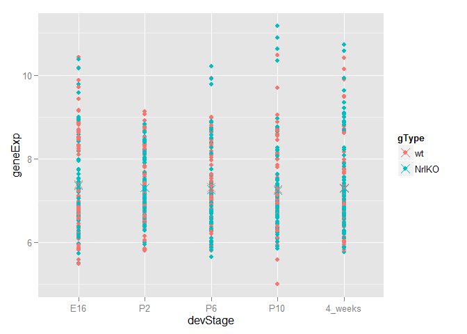
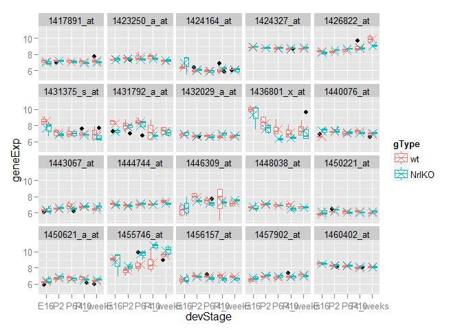

# Seminar 03b
Olivia  
Tuesday, February 03, 2015  
Seminar outline: 
The full photoRec dataset has 39 samples and 29,949 probesets. Choose 2 . or 20 . or 200 random probesets/genes and look for gene expression differences between the two genotypes, wild type versus knockout. Make use of the graphing techniques discussed this week such as scatter plots, box plot, etc. 

First setting up for the subsequent graphs. 


```r
library(ggplot2)
kDat <- read.table("GSE4051_data.tsv")
str(kDat)
```

```
## 'data.frame':	29949 obs. of  39 variables:
##  $ Sample_20: num  7.24 9.48 10.01 8.36 8.59 ...
##  $ Sample_21: num  7.41 10.02 10.04 8.37 8.62 ...
##  $ Sample_22: num  7.17 9.85 9.91 8.4 8.52 ...
##  $ Sample_23: num  7.07 10.13 9.91 8.49 8.64 ...
##  $ Sample_16: num  7.38 7.64 8.42 8.36 8.51 ...
##  $ Sample_17: num  7.34 10.03 10.24 8.37 8.89 ...
##  $ Sample_6 : num  7.24 9.71 10.17 8.84 8.54 ...
##  $ Sample_24: num  7.11 9.75 9.39 8.37 8.36 ...
##  $ Sample_25: num  7.19 9.16 10.11 8.2 8.5 ...
##  $ Sample_26: num  7.18 9.49 9.41 8.73 8.39 ...
##  $ Sample_27: num  7.21 8.64 9.43 8.33 8.43 ...
##  $ Sample_14: num  7.09 9.56 9.88 8.57 8.59 ...
##  $ Sample_3 : num  7.16 9.55 9.84 8.33 8.5 ...
##  $ Sample_5 : num  7.08 9.32 9.24 8.3 8.48 ...
##  $ Sample_8 : num  7.11 8.24 9.13 8.13 8.33 ...
##  $ Sample_28: num  7.34 8.27 9.47 8.38 8.4 ...
##  $ Sample_29: num  7.66 10.03 9.88 8.56 8.69 ...
##  $ Sample_30: num  7.26 9.27 10.54 8.15 8.55 ...
##  $ Sample_31: num  7.31 9.26 10.1 8.37 8.49 ...
##  $ Sample_1 : num  7.15 9.87 9.68 8.28 8.5 ...
##  $ Sample_10: num  7.28 10.29 9.91 8.42 8.68 ...
##  $ Sample_4 : num  7.18 10.16 9.72 8.32 8.5 ...
##  $ Sample_7 : num  7.15 8.95 9.3 8.17 8.41 ...
##  $ Sample_32: num  7.54 9.53 9.92 8.78 8.57 ...
##  $ Sample_33: num  7.01 8.97 9.22 8.42 8.53 ...
##  $ Sample_34: num  6.81 8.83 9.39 8.1 8.32 ...
##  $ Sample_35: num  7.15 9.22 10.06 8.35 8.45 ...
##  $ Sample_13: num  7.33 9.33 9.75 8.43 8.48 ...
##  $ Sample_15: num  7.12 9.15 9.84 8.32 8.21 ...
##  $ Sample_18: num  7.21 9.49 10.03 8.55 8.5 ...
##  $ Sample_19: num  7.21 9.21 9.59 8.31 8.31 ...
##  $ Sample_36: num  7.25 9.66 9.51 8.49 8.42 ...
##  $ Sample_37: num  7.04 8.38 9.21 8.75 8.26 ...
##  $ Sample_38: num  7.37 9.44 9.48 8.49 8.34 ...
##  $ Sample_39: num  7.13 8.73 9.53 8.65 8.28 ...
##  $ Sample_11: num  7.42 9.83 10 8.6 8.43 ...
##  $ Sample_12: num  7.11 9.71 9.43 8.43 8.5 ...
##  $ Sample_2 : num  7.35 9.66 9.91 8.4 8.37 ...
##  $ Sample_9 : num  7.32 9.8 9.85 8.4 8.46 ...
```

```r
kDes <- readRDS("GSE4051_design.rds")
str(kDes)
```

```
## 'data.frame':	39 obs. of  4 variables:
##  $ sidChar : chr  "Sample_20" "Sample_21" "Sample_22" "Sample_23" ...
##  $ sidNum  : num  20 21 22 23 16 17 6 24 25 26 ...
##  $ devStage: Factor w/ 5 levels "E16","P2","P6",..: 1 1 1 1 1 1 1 2 2 2 ...
##  $ gType   : Factor w/ 2 levels "wt","NrlKO": 1 1 1 1 2 2 2 1 1 1 ...
```

```r
set.seed(1)
```

Now selecting a random set of 20 probesets. 


```r
samp <- sample(1:nrow(kDat), size = 20)
samDat <- kDat[samp, ]
str(samDat)
```

```
## 'data.frame':	20 obs. of  39 variables:
##  $ Sample_20: num  8.3 8.25 6.91 6.79 6.4 ...
##  $ Sample_21: num  8.33 9.14 6.55 6.23 6.69 ...
##  $ Sample_22: num  8.43 8.19 6.59 6.69 6.14 ...
##  $ Sample_23: num  8.49 8.66 6.58 6.34 6.34 ...
##  $ Sample_16: num  8.51 6.66 7.75 7.25 5.5 ...
##  $ Sample_17: num  8.18 7.95 6.85 6.38 7.51 ...
##  $ Sample_6 : num  7.96 8.45 7.42 6.19 7.64 ...
##  $ Sample_24: num  8.34 7.49 7.17 6.84 5.83 ...
##  $ Sample_25: num  8.14 7.39 7.12 7.02 5.85 ...
##  $ Sample_26: num  8.45 6.94 7.46 7.43 6.32 ...
##  $ Sample_27: num  8.25 6.5 7.23 6.91 5.8 ...
##  $ Sample_14: num  8.46 6.99 7.14 6.78 6.29 ...
##  $ Sample_3 : num  8.53 7.14 7.23 6.88 6.15 ...
##  $ Sample_5 : num  8.45 6.71 7.36 6.92 6 ...
##  $ Sample_8 : num  8.62 6.66 7.9 6.97 5.95 ...
##  $ Sample_28: num  8.63 6.46 7.45 7.17 6.03 ...
##  $ Sample_29: num  8.58 7.84 6.72 6.91 6.31 ...
##  $ Sample_30: num  8.28 7.01 6.81 6.75 5.81 ...
##  $ Sample_31: num  8.47 6.88 7.18 6.89 5.79 ...
##  $ Sample_1 : num  8.66 6.81 7.22 6.56 6.03 ...
##  $ Sample_10: num  8.68 7.41 6.97 6.5 5.99 ...
##  $ Sample_4 : num  8.74 7.23 6.91 6.78 5.82 ...
##  $ Sample_7 : num  8.69 6.61 7.43 7.1 5.64 ...
##  $ Sample_32: num  9.7 7.62 6.96 6.89 6.82 ...
##  $ Sample_33: num  8.72 6.83 7.36 7.21 5.93 ...
##  $ Sample_34: num  8.58 6.73 7.63 7.19 5.93 ...
##  $ Sample_35: num  8.54 6.91 7.14 6.71 5.59 ...
##  $ Sample_13: num  8.73 6.83 7.14 6.46 6.25 ...
##  $ Sample_15: num  8.57 6.86 7.12 6.72 5.84 ...
##  $ Sample_18: num  8.96 6.95 6.96 6.31 6.44 ...
##  $ Sample_19: num  8.65 6.69 7.03 6.91 6.32 ...
##  $ Sample_36: num  10.41 7.9 6.57 6.87 6.09 ...
##  $ Sample_37: num  9.48 6.36 6.99 6.85 6.08 ...
##  $ Sample_38: num  10.14 7.24 6.95 6.99 6.13 ...
##  $ Sample_39: num  9.48 6.21 6.97 7.13 6.02 ...
##  $ Sample_11: num  9.09 6.23 7 6.4 6.22 ...
##  $ Sample_12: num  9.21 6.47 7.17 6.78 5.76 ...
##  $ Sample_2 : num  9.05 6.2 7.2 6.54 5.9 ...
##  $ Sample_9 : num  8.89 7.67 6.86 6.72 6.26 ...
```

```r
sDat <- with(kDes, data.frame(sidChar, sidNum, devStage, gType, probeset = factor(rep(rownames(samDat), each = nrow(kDes))), geneExp = as.vector(t(as.matrix(samDat)))))
str(sDat)
```

```
## 'data.frame':	780 obs. of  6 variables:
##  $ sidChar : Factor w/ 39 levels "Sample_1","Sample_10",..: 13 14 15 16 8 9 36 17 18 19 ...
##  $ sidNum  : num  20 21 22 23 16 17 6 24 25 26 ...
##  $ devStage: Factor w/ 5 levels "E16","P2","P6",..: 1 1 1 1 1 1 1 2 2 2 ...
##  $ gType   : Factor w/ 2 levels "wt","NrlKO": 1 1 1 1 2 2 2 1 1 1 ...
##  $ probeset: Factor w/ 20 levels "1417891_at","1423250_a_at",..: 5 5 5 5 5 5 5 5 5 5 ...
##  $ geneExp : num  8.3 8.33 8.43 8.49 8.51 ...
```

Now that everything is set up, let's look at the gene expression difference between WT and KO for the 200 ramdom probsets in various graphs. First, let's try plotting a stripplot. 


```r
(p <- ggplot(sDat, aes(x= devStage ,y= geneExp, color = gType)) + geom_point() + stat_summary(fun.y = mean, geom = "point", shape = 4, size = 4))
```

 

As one can see, the stripplot does not seem to be very informative. Let's try plotting a box plot instead. We can make one boxplot for each of the 20 probes that was randomly seleted in the begining.  


```r
ggplot(sDat, aes(devStage, geneExp, color = gType)) + geom_boxplot()  + facet_wrap(~ probeset, ncol=5) + stat_summary(fun.y = mean, geom = "point", shape = 4, size = 4)
```

 

With the boxplot, one can see clearly that there are differential expression at different probes in relation to the develop stage of samples. Thus it seems that a box plot is a good representation to see differential gene expression in a small random samples size. 


