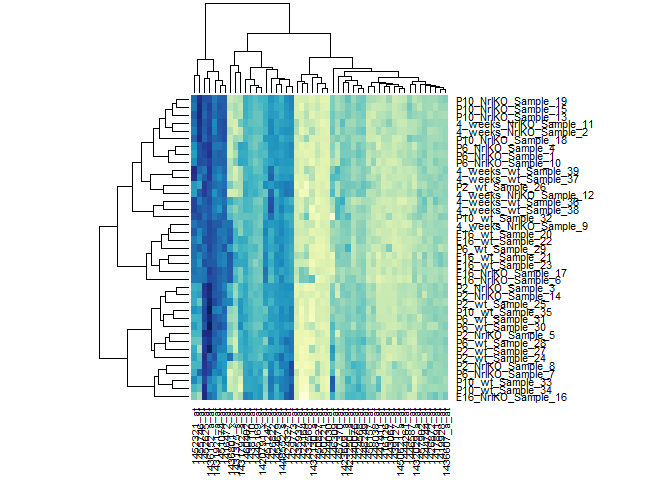
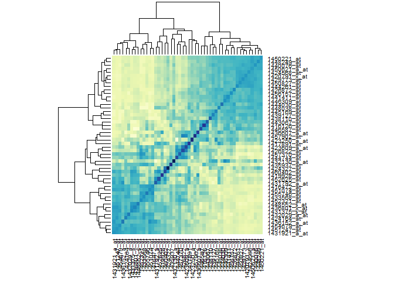

# Seminar 03c
This portion of the seminar works on graphing techniques using "lattice" instead of "ggplot2" in 3b. 
Again, let us begin by first setting up as we did in seminar 03b. 


```r
library(lattice)
prDat  <- read.table("GSE4051_data.tsv")
prDes <- readRDS("GSE4051_design.rds")
```

The seminar outline from the website is as follows:
"The full photoRec dataset has 39 samples and 29949 probesets. Using Lattice, choose 2 … or 20 … or 200 random probesets/genes and look for gene expression differences between the two genotypes, wild type versus knockout. Make use of the graphing techniques discussed this week such as scatter plots, data heatmaps, correlation heatmaps, etc. Share questions, success, failure on the Github-based discussion forum."

As in seminar 03b I have looked at 20 random probsets, in this seminar I will look at 50 random probsets instead. The higher number of probsets may also make the heatmaps seem more reasonable. 

First let's make R define the random 50 probesets for us. 

```r
set.seed(1)
samp <- sample(1:nrow(prDat), size = 50)
nDat <- prDat[samp, ]
str(nDat)
```

```
## 'data.frame':	50 obs. of  39 variables:
##  $ Sample_20: num  8.3 8.25 6.91 6.79 6.4 ...
##  $ Sample_21: num  8.33 9.14 6.55 6.23 6.69 ...
##  $ Sample_22: num  8.43 8.19 6.59 6.69 6.14 ...
##  $ Sample_23: num  8.49 8.66 6.58 6.34 6.34 ...
##  $ Sample_16: num  8.51 6.66 7.75 7.25 5.5 ...
##  $ Sample_17: num  8.18 7.95 6.85 6.38 7.51 ...
##  $ Sample_6 : num  7.96 8.45 7.42 6.19 7.64 ...
##  $ Sample_24: num  8.34 7.49 7.17 6.84 5.83 ...
##  $ Sample_25: num  8.14 7.39 7.12 7.02 5.85 ...
##  $ Sample_26: num  8.45 6.94 7.46 7.43 6.32 ...
##  $ Sample_27: num  8.25 6.5 7.23 6.91 5.8 ...
##  $ Sample_14: num  8.46 6.99 7.14 6.78 6.29 ...
##  $ Sample_3 : num  8.53 7.14 7.23 6.88 6.15 ...
##  $ Sample_5 : num  8.45 6.71 7.36 6.92 6 ...
##  $ Sample_8 : num  8.62 6.66 7.9 6.97 5.95 ...
##  $ Sample_28: num  8.63 6.46 7.45 7.17 6.03 ...
##  $ Sample_29: num  8.58 7.84 6.72 6.91 6.31 ...
##  $ Sample_30: num  8.28 7.01 6.81 6.75 5.81 ...
##  $ Sample_31: num  8.47 6.88 7.18 6.89 5.79 ...
##  $ Sample_1 : num  8.66 6.81 7.22 6.56 6.03 ...
##  $ Sample_10: num  8.68 7.41 6.97 6.5 5.99 ...
##  $ Sample_4 : num  8.74 7.23 6.91 6.78 5.82 ...
##  $ Sample_7 : num  8.69 6.61 7.43 7.1 5.64 ...
##  $ Sample_32: num  9.7 7.62 6.96 6.89 6.82 ...
##  $ Sample_33: num  8.72 6.83 7.36 7.21 5.93 ...
##  $ Sample_34: num  8.58 6.73 7.63 7.19 5.93 ...
##  $ Sample_35: num  8.54 6.91 7.14 6.71 5.59 ...
##  $ Sample_13: num  8.73 6.83 7.14 6.46 6.25 ...
##  $ Sample_15: num  8.57 6.86 7.12 6.72 5.84 ...
##  $ Sample_18: num  8.96 6.95 6.96 6.31 6.44 ...
##  $ Sample_19: num  8.65 6.69 7.03 6.91 6.32 ...
##  $ Sample_36: num  10.41 7.9 6.57 6.87 6.09 ...
##  $ Sample_37: num  9.48 6.36 6.99 6.85 6.08 ...
##  $ Sample_38: num  10.14 7.24 6.95 6.99 6.13 ...
##  $ Sample_39: num  9.48 6.21 6.97 7.13 6.02 ...
##  $ Sample_11: num  9.09 6.23 7 6.4 6.22 ...
##  $ Sample_12: num  9.21 6.47 7.17 6.78 5.76 ...
##  $ Sample_2 : num  9.05 6.2 7.2 6.54 5.9 ...
##  $ Sample_9 : num  8.89 7.67 6.86 6.72 6.26 ...
```

```r
sDat <- with(prDes, data.frame(sidChar, sidNum, devStage, gType, probeset = factor(rep(rownames(nDat), each = nrow(prDes))), geneExp = as.vector(t(as.matrix(nDat)))))
str(sDat)
```

```
## 'data.frame':	1950 obs. of  6 variables:
##  $ sidChar : Factor w/ 39 levels "Sample_1","Sample_10",..: 13 14 15 16 8 9 36 17 18 19 ...
##  $ sidNum  : num  20 21 22 23 16 17 6 24 25 26 ...
##  $ devStage: Factor w/ 5 levels "E16","P2","P6",..: 1 1 1 1 1 1 1 2 2 2 ...
##  $ gType   : Factor w/ 2 levels "wt","NrlKO": 1 1 1 1 2 2 2 1 1 1 ...
##  $ probeset: Factor w/ 50 levels "1416126_at","1416472_at",..: 11 11 11 11 11 11 11 11 11 11 ...
##  $ geneExp : num  8.3 8.33 8.43 8.49 8.51 ...
```

As the seminar outline suggested, I am going to first try to plot the data as a scatter plot. 

```r
xyplot(geneExp ~ probeset , sDat, groups = gType, auto.key = TRUE)
```

 

As one can see, the presentation of the sample data set via a scatter plot (which resembles a stripplot), is not very informative. It seems much more intuitative to visualize the data via a heatmap but first we would have to transform the dataframe into a matrix as shown below.


```r
nDat <- as.matrix(t(nDat)) 
rownames(nDat) <- with(prDes, paste(devStage, gType, sidChar, sep="_"))
str(nDat)
```

```
##  num [1:39, 1:50] 8.3 8.33 8.43 8.49 8.51 ...
##  - attr(*, "dimnames")=List of 2
##   ..$ : chr [1:39] "E16_wt_Sample_20" "E16_wt_Sample_21" "E16_wt_Sample_22" "E16_wt_Sample_23" ...
##   ..$ : chr [1:50] "1426822_at" "1431375_s_at" "1440076_at" "1456157_at" ...
```

Now that the data is in matrix format, let's make a basic heatmap!


```r
library(RColorBrewer)
YelBl <- colorRampPalette(brewer.pal(n = 9, "YlGnBu"))
heatmap(nDat, margins = c(5, 8), col = YelBl(1950))
```

 

From this particular heatmap, it does not really help with the visualization of the data. Also note that it is harder now to compare the effects of genotype on expression as the heat map  Let's refine the heatmap to try and make a correlation heatmap using the heatmap function again! 

```r
heatmap(cor(nDat), margins = c(5,8), col = YelBl(1950))
```

 

Note that although this heatmap shows a correlation between the groups, a careful look will reveal the fact that the heatmap only depicts a correlation between the randomly selected probesets! I have yet to figure out how to show the correlation between genotype and gene expression at various probesets...

