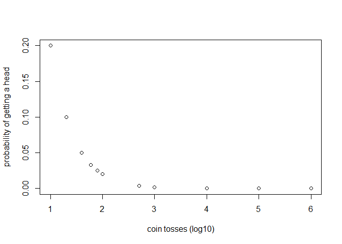

# Seminar02b take home problem
Olivia  
Monday, January 26, 2015  


This solution will be done using the runif() function. 

The first time doing this simulation will be done in the long way. 
I will first define the number of coin flips (sample size) as n and the probablity of the heads coming up as 0.5. 

Simulation will go as below if there are 10 tosses:

```r
n1 <- 10
coin1 <- runif(n1, min = 0, max = 1)>0.5
(p1 <- sum(coin1)/n1)
```

```
## [1] 0.5
```

This trial indicates that the probability of getting a head in 10 tosses is not exactly 0.5. 

Lets now look at several sample sizes of coin tosses (100, 1000, 10000, 100000, 1000000) and where the probability of getting a head is stil 0.5.

```r
n2 <- 100
coin2 <- runif(n2, min = 0, max = 1)>0.5
(p2 <- sum(coin2)/n2)
```

```
## [1] 0.48
```

```r
n3 <- 1000
coin3 <- runif(n3, min = 0, max = 1)>0.5
(p3 <- sum(coin3)/n3)
```

```
## [1] 0.482
```

```r
n4 <- 10000
coin4 <- runif(n4, min = 0, max = 1)>0.5
(p4 <- sum(coin4)/n4)
```

```
## [1] 0.5024
```

```r
n5 <- 100000
coin5 <- runif(n5, min = 0, max = 1)>0.5
(p5 <- sum(coin5)/n5)
```

```
## [1] 0.50054
```

```r
n6 <- 1000000
coin6 <- runif(n6, min = 0, max = 1)>0.5
(p6 <- sum(coin6)/n6)
```

```
## [1] 0.499611
```

As we increase the number of coin tosses, it appears that the obtained probability of getting a head is approaching 0.5. 

For ease, the probabilities will be plotted as a scatter-plot. 

```r
nsample <- c(n1, n2, n3, n4, n5, n6)
psample <- c(p1, p2, p3, p4, p5, p6)
plot(log10(nsample), psample, type = "p", xlab = 'coin tosses (log10)', ylab = 'probability of getting a head')
abline(0.5,0, col = 'red')
```

 

As one can see, as the sample size grows, the probability of getting a head approaches 0.5, which is donoted as a red line in the plot above. 

IF I were to change the expected probability of getting a head from 0.5 (ie. a fair coin), to something random like 0.7, I will have to change my code above bit by bit. However, instead of doing that, I would like to look at a higher number of sample sizes with hopefully just a few lines of code. 


```r
nsample <- c(10, 20, 40, 60,80,100, 500, 1000, 10000, 100000,1000000)
coinsample <- runif(nsample, min = 0, max = 1)>0.7
psample <-sum(coinsample)/nsample
```
Without showing the probability obtained in each population, as there are so many, I will immediately plot all of my probabilities and sample sizes in a scatter plot. 


```r
plot(log10(nsample), psample, type = "p", xlab = 'coin tosses (log10)', ylab = 'probability of getting a head')     
```

 

The probability of getting a head with an unfair coin will not give a probability of 0.5 as the population gets larger.
